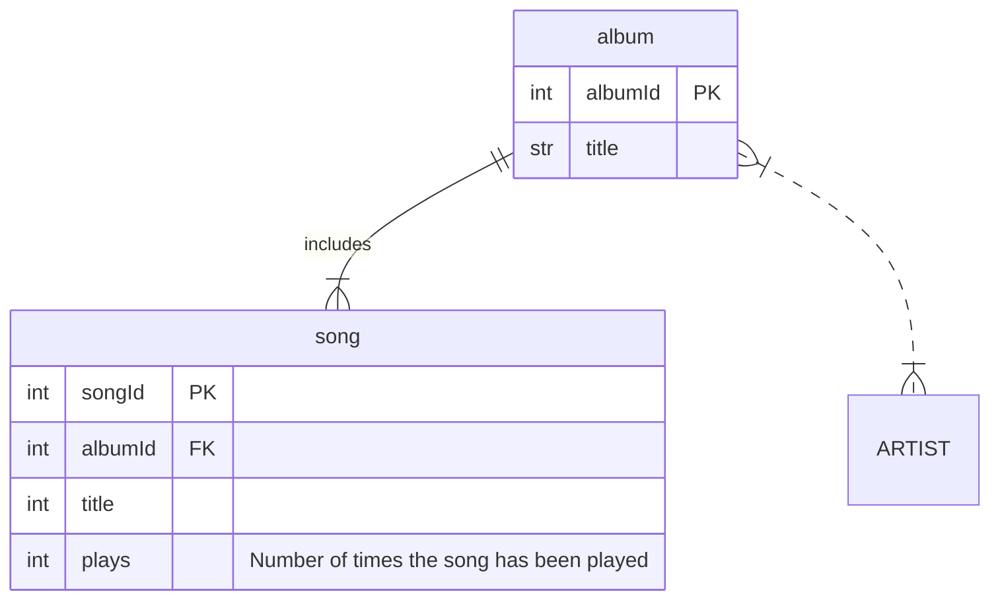

# mORMaid

`mormaid` allows users to programmatically generate diagrams using an ORM-style interface, then compile those diagrams into valid [mermaid](https://mermaid.js.org/intro/) files or strings.

## Quick start

```rust
use mormaid::erd::{Attribute, Cardinality, Entity, Relationship, ERD};

// create Entities with attributes and other details
let album_table = Entity::new("ALBUM")
    .with_alias("album")
    .with_attribute(Attribute::new("int", "albumId").as_primary_key())
    .with_attribute(Attribute::new("str", "title"));

// such as foreign key constraints and comments
let song_table = Entity::new("SONG")
    .with_alias("song")
    .with_attribute(Attribute::new("int", "songId").as_primary_key())
    .with_attribute(Attribute::new("int", "albumId").as_foreign_key())
    .with_attribute(Attribute::new("int", "title"))
    .with_attribute(
        Attribute::new("int", "plays")
            .with_comment("Number of times the song has been played"),
    );

// create a relationship between previously created entities
let album_songs = Relationship::new(
    &album_table.id.as_str(),
    &song_table.id.as_str(),
    Cardinality::ExactlyOne,
    Cardinality::OneOrMore,
)
.with_label("includes");

// create a relationship between an existing entity and a new entity
// that will be automatically created on insertion
let album_artists = Relationship::new(
    &album_table.id.as_str(),
    "ARTIST",
    Cardinality::OneOrMore,
    Cardinality::OneOrMore,
)
.as_non_identifying();

// create the diagram and insert the entities and relationships
// note that the "ARTIST" entity will be created with the relationship
let diagram = ERD::new()
    .with_entity(album_table)
    .with_entity(song_table)
    .with_relationship(album_songs)
    .with_relationship(album_artists);

// print the diagram with valid mermaid syntax
println!("{diagram}");
```

Which prints the following to the console:

```
erDiagram
    %% Entities start
    SONG["song"] {
        int songId PK
        int albumId FK
        int title
        int plays "Number of times the song has been played"
    }
    ARTIST
    ALBUM["album"] {
        int albumId PK
        str title
    }
    %% Entities end
    %% Relationships start
    ALBUM ||--|{ SONG : "includes"
    ALBUM }|..|{ ARTIST : ""
    %% Relationships end
```

And produces the following mermaid diagram



## Usage

Some potential applications for this library include:

- Auto-generating mermaid ERDs from database schemas
- Auto-generating mermaid class diagrams using reflection
- Providing a type-safe method for generating mermaid diagrams dynamically
- Transpiling diagrams from other graph formats (e.g. Graph Viz) to mermaid

## Maintainers

- @widal001
